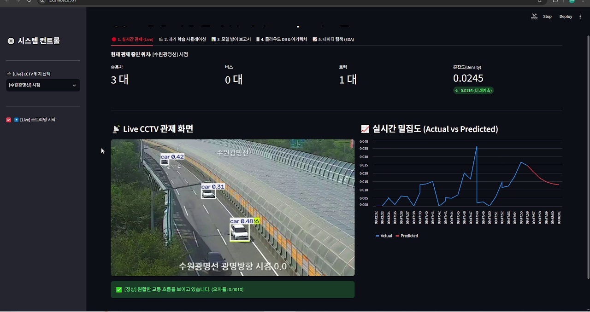
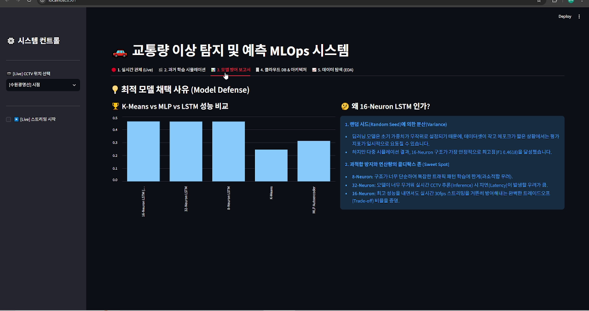
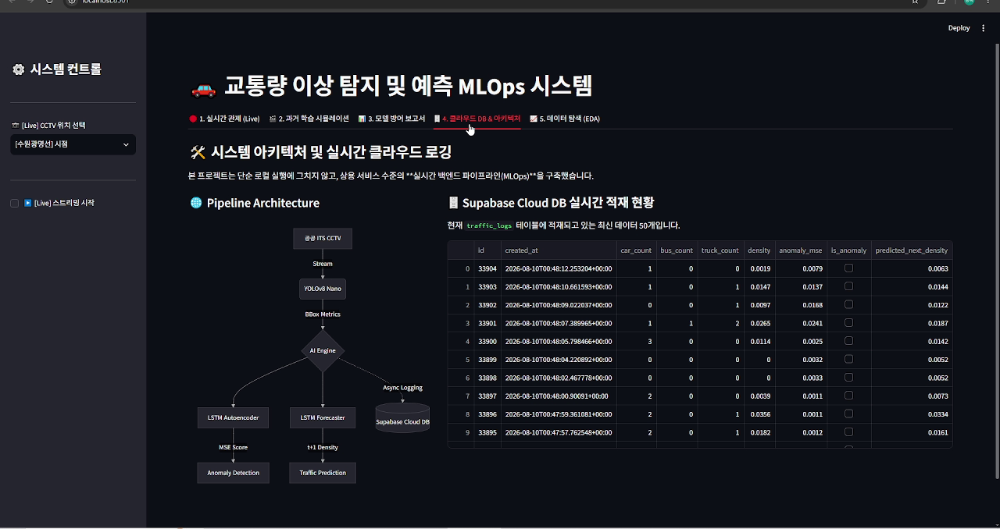

# AI 기반 교통 이상 행동 탐지 시스템

실시간 CCTV 영상에서 차량을 탐지하고, 교통 밀집도와 시계열 패턴을 분석해 이상 상황과 미래 혼잡을 예측하는 개인 딥러닝 프로젝트입니다. Streamlit 대시보드, Supabase 로깅, 공공 CCTV API를 결합해 실시간 관제 흐름을 구현합니다.

## 실행 화면

### 실시간 CCTV 차량 탐지와 밀집도 예측



### 이상 탐지 모델 비교와 선정 근거



### MLOps 파이프라인과 Supabase 로깅



## 핵심 기능

- ITS 공공데이터 API 기반 CCTV 목록 및 스트림 조회
- YOLOv8 기반 승용차·버스·트럭 탐지
- 주간·야간 환경에 따른 탐지 신뢰도 동적 조정
- LSTM Autoencoder 기반 교통 이상 탐지
- GRU 기반 다중 스텝 교통량 예측
- 실제값과 예측값 비교 및 돌발 정체 시뮬레이션
- Supabase 비동기 로그 적재와 누적 데이터 분석
- 영상 업로드 기반 오프라인 시뮬레이션

## 모델 구성

### 객체 탐지

YOLOv8 Nano·Small·Medium을 비교하고 실시간 처리 속도와 탐지 성능의 균형을 고려해 경량 모델을 관제 파이프라인에 활용합니다.

### 이상 탐지

K-Means, MLP Autoencoder, LSTM Autoencoder를 비교합니다. 시계열 맥락과 추론 효율을 고려한 LSTM Autoencoder를 사용하며, 복원 오차와 저장된 임계값으로 이상 여부를 판단합니다.

### 교통량 예측

LSTM, 1D-CNN, GRU를 비교하고 GRU 기반 예측 모델로 미래 교통량을 추론합니다. 실시간 화면에서는 최근 관측 추세와 모델 예측을 결합해 단기 예측의 안정성을 높입니다.

## 기술 스택

- Python, TensorFlow/Keras
- Ultralytics YOLOv8
- OpenCV, NumPy, pandas
- scikit-learn, SciPy, statsmodels
- Streamlit
- Supabase
- ITS 공공데이터 API
- Matplotlib, Seaborn

## 프로젝트 구조

```text
Deep_Learning/
├── app.py                         # 통합 Streamlit 관제 대시보드
├── demo_api.py                    # 공공 CCTV API 실시간 데모
├── demo_video.py                  # 로컬 영상 기반 데모
├── notebooks/
│   └── Total_Pipeline.ipynb       # EDA, 모델 비교, 학습 및 저장
├── models/                        # YOLO·이상탐지·예측 모델과 설정
├── dataset/                       # 영상 및 학습용 특징 데이터
├── requirements.txt
└── PROGRESS.md                    # 실험·트러블슈팅 기록
```

## 환경 설정

루트에 `.env`를 만들고 실제 값을 입력합니다. 비밀키가 포함된 `.env`는 Git에 커밋하지 마세요.

```dotenv
ITS_API_KEY=your_its_api_key
SUPABASE_URL=your_supabase_url
SUPABASE_KEY=your_supabase_key
```

## 실행 방법

```bash
python -m venv .venv
.venv\Scripts\activate
pip install -r requirements.txt
streamlit run app.py
```

CLI 데모는 필요에 따라 다음과 같이 실행합니다.

```bash
python demo_api.py
python demo_video.py
```

## 실행 전 확인 사항

- `models/`에 코드가 참조하는 YOLO, LSTM Autoencoder, GRU 및 scaler 파일이 있어야 합니다.
- 오프라인 시연에는 `dataset/` 아래의 원본 영상이 필요합니다.
- 공공 CCTV 스트림은 네트워크 상태와 API 정책에 따라 연결되지 않을 수 있습니다.
- 클라우드 환경의 해외 IP에서는 ITS 스트림 접근이 제한될 수 있어 국내 로컬 실행이 적합합니다.

## 분석 노트북

`notebooks/Total_Pipeline.ipynb`는 데이터 탐색, 객체 탐지 모델 비교, 이상 탐지 모델 비교, 동적 임계값 탐색, 모델 저장까지 전체 실험 흐름을 담고 있습니다. 모델을 다시 만들거나 평가 근거를 확인할 때 노트북을 처음부터 실행하세요.

## 한계와 개선 방향

- 야간·악천후·저화질 영상에 대한 별도 검증 데이터 확대
- 임계값과 저교통량 예외 규칙의 운영 데이터 기반 재보정
- 모델 파일 버전과 학습 데이터 메타데이터 관리
- 추론·DB 적재·UI 렌더링의 비동기 서비스 분리
